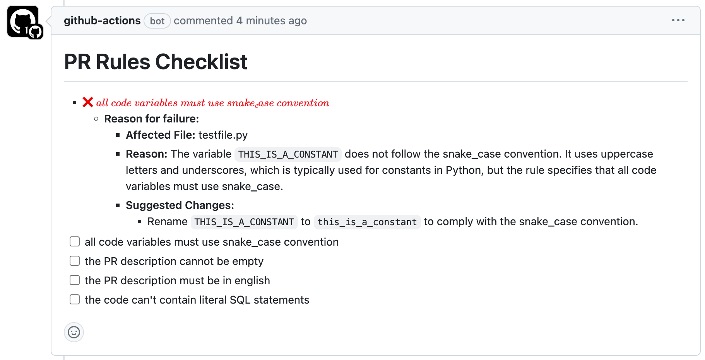

# PR-rules
Github Action for checking a given PR against a markdown file with checklist rules written in natural language. It uses a team of experts to assest and validate your repo rules.

# Requirements
- OpenAI API Key

# Sample usage
On the root of your repo, create a file called pr-rules.md with the following contents:

```md
[] all code variables must use snake_case convention
[] the PR description cannot be empty
[] the PR description must be in english
[] the methods names should always have descriptive names 
[] the code can't contain literal SQL statements
[] no code diff should be more than 100 lines 
```

then on your repo create a github workflow template like the following:

```yml
name: PR BOT

on:
  pull_request:
    types: [opened, synchronize, reopened]

# this is needed for the action to be able to post comments
permissions:
  issues: write
  pull-requests: write
  contents: read
  
jobs:
  test-action:
    runs-on: ubuntu-latest

    steps:
      - name: Checkout code
        uses: actions/checkout@v2

      - name: Run PR BOT
        uses: puntorigen/pr-rules@v1.0.0
        with:
          github-token: ${{ secrets.GITHUB_TOKEN }}
          openai-api-key: 'your-api-key'
          file-path: 'pr-rules.md'

```

Now everytime you create a PR on your repo, the action will check it complies to the rules specified on the markdown and write a comment with them checked if successful or not. If not valid, below the item there'll be an explanation.

## Example Comment by BOT
