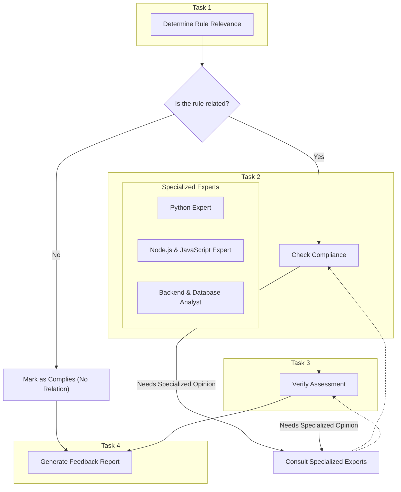

## Single Rule Validation

```mermaid
flowchart TD
    A[Determine Rule Relevance] --> B{Is the rule related?}
    B -- Yes --> C[Check Compliance]
    B -- No --> D["Mark as Complies (No Relation)"]
    C --> E[Verify Assessment]
    D --> F[Generate Feedback Report]
    E --> F[Generate Feedback Report]

    C -- Needs Specialized Opinion --> G[Consult Specialized Experts]
    E -- Needs Specialized Opinion --> G
    G -.-> C
    G -.-> E

    subgraph Task 1
        A
    end

    subgraph Task 2
        C
        subgraph Specialized Experts
            G1[Python Expert]
            G2[Node.js & JavaScript Expert]
            G3[Backend & Database Analyst]
        end
    end

    subgraph Task 3
        E
    end

    subgraph Task 4
        F
    end
```